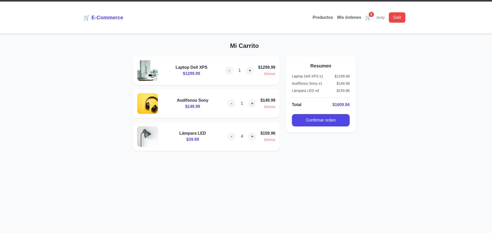
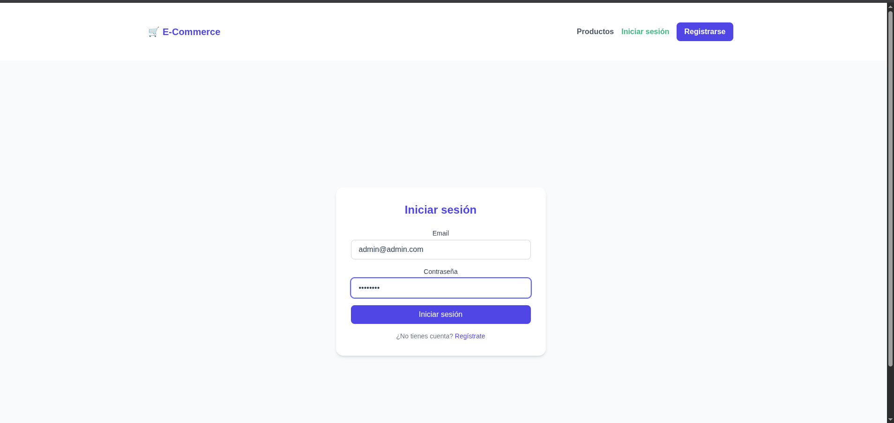
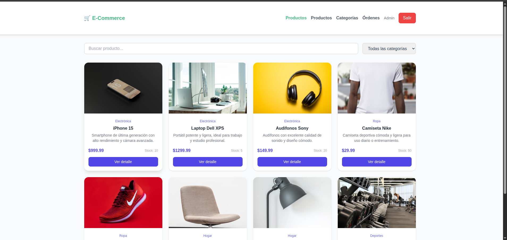
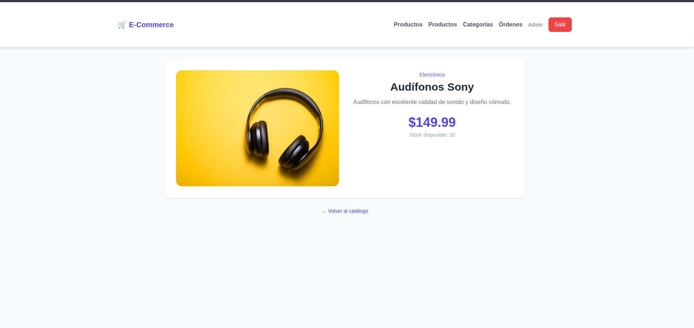
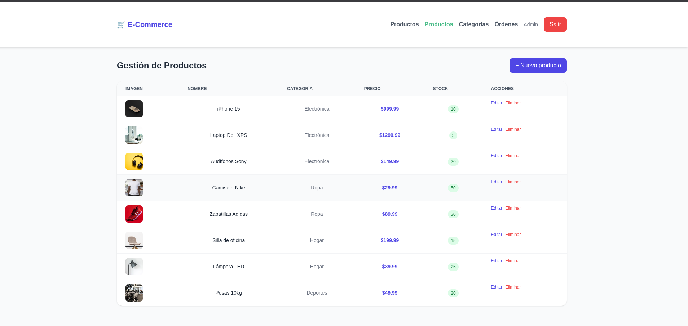
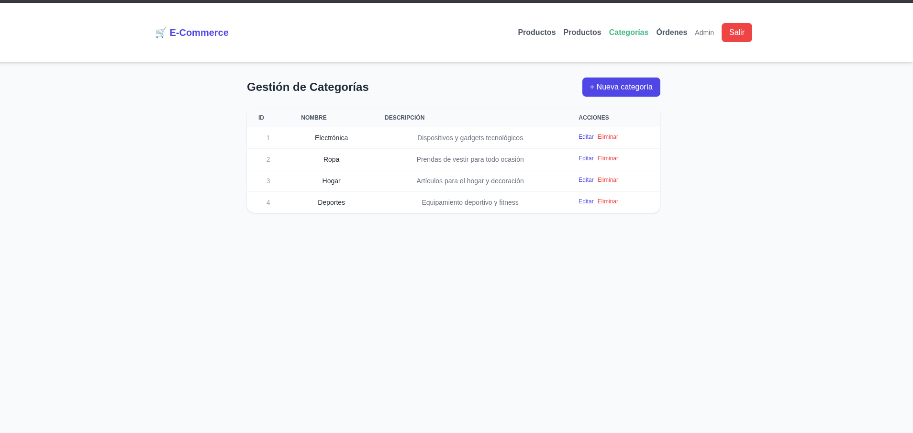

# 🛒 E-Commerce Full Stack — Docker

Proyecto de e-commerce completo con Spring Boot, Vue 3 y PostgreSQL. Levanta todos los servicios con un solo comando usando Docker.

## 🧱 Tecnologías

**Backend**
- Java 21
- Spring Boot 3.2
- Spring Security + JWT
- PostgreSQL
- Swagger / OpenAPI

**Frontend**
- Vue 3
- Tailwind CSS
- Axios
- Vue Router

**DevOps**
- Docker
- Docker Compose

## 📦 Servicios

| Servicio   | Tecnología    | Puerto |
|------------|---------------|--------|
| Frontend   | Vue 3 + Nginx | 80     |
| Backend    | Spring Boot   | 8080   |
| Base datos | PostgreSQL 15 | 5432   |

## 🚀 Cómo correr el proyecto

### Requisitos
- Docker instalado
- Docker Compose

### Pasos

1. Clona este repositorio:
```bash
git clone https://github.com/tuusuario/ecommerce-docker.git
cd ecommerce-docker
```

2. Levanta todos los servicios:
```bash
docker compose up --build
```

3. Espera a que todos los servicios estén listos. Verás en los logs:
```
Started DockerApplication in X seconds
```

4. Accede a la aplicación:

| URL | Descripción |
|-----|-------------|
| http://localhost | Frontend |
| http://localhost:8080/swagger-ui.html | Swagger API |

## 👤 Crear usuario administrador

Una vez levantado el proyecto, crea el usuario admin desde Swagger:

```
POST http://localhost:8080/api/auth/register-admin
```

```json
{
  "name": "Admin",
  "email": "admin@admin.com",
  "password": "admin123"
}
```

## ✨ Funcionalidades

**Cliente**
- Registro e inicio de sesión con JWT
- Catálogo de productos con búsqueda y filtros por categoría
- Detalle de producto
- Carrito de compras
- Historial de órdenes

**Administrador**
- Gestión de productos (CRUD)
- Gestión de categorías (CRUD)
- Gestión y actualización de estados de órdenes

## 🗂️ Repositorios

| Repositorio | Enlace |
|-------------|--------|
| Backend | https://github.com/JordyChamba/E-commerce-Backend |
| Frontend | https://github.com/JordyChamba/E-commerce-Frontend |

## 📁 Estructura del proyecto

```
ecommerce-docker/
├── docker-compose.yml
└── README.md
```

## ⚙️ Variables de entorno

El `docker-compose.yml` incluye las siguientes variables configurables:

| Variable | Valor por defecto |
|----------|------------------|
| POSTGRES_DB | ecommerce_db |
| POSTGRES_USER | postgres |
| POSTGRES_PASSWORD | root |
| JWT_SECRET | (incluido en docker-compose) |
| JWT_EXPIRATION | 86400000 (24 horas) |## 🖼️ Capturas

A continuación se muestran las imágenes del proyecto:












